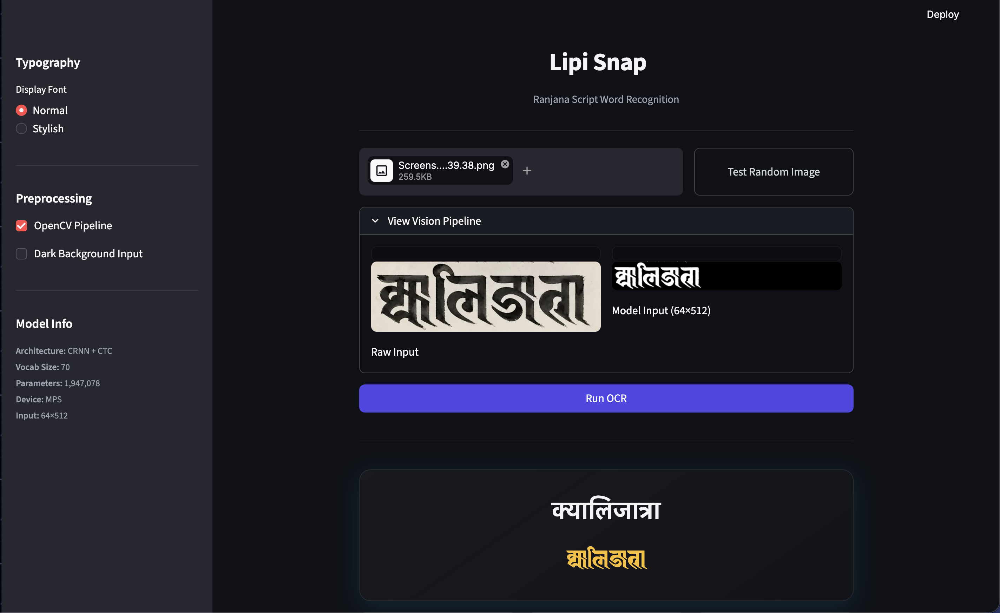
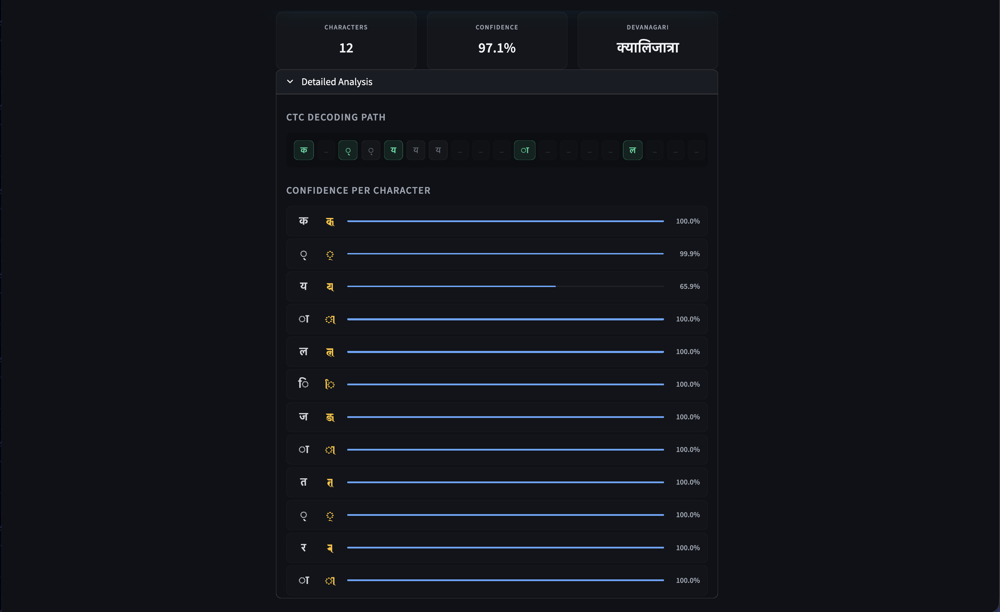

## 🌟 Lipi Snap — Ranjana Script Word Recognition Model

<p align="center">
  
  <br><em>Main interface showcasing image uploading, OpenCV visual preprocessing, and real-time word prediction</em><br><br>
  
  <br><em>Detailed metrics breakdown showcasing the greedy CTC decoding path and character-level prediction confidence</em><br>
</p>

---
### 📖 Overview

**Ranjana Script Word Recognition** - is a deep learning OCR pipeline that reads full Nepali words rendered in Ranjana (Nepal Lipi) script and outputs their Devanagari transliteration. Built on a **CRNN + CTC architecture**, the model is trained on a massive synthetic dataset of 241k+ images and achieves highly robust and reliable recognition capabilities on both seen and unseen vocabularies.

> **NOTE:** For the older *character-level* CharCNN, see [`CharCNN/`](./CharCNN/) or the [Archive Documentation](./CharCNN_archieve.md).

### ✨ Features
---
- **Word-level recognition** — Predicts entire Nepali words in one shot; no segmentation required.
- **CRNN + CTC architecture** — Standard pipeline (CNN + BiLSTM + CTC Loss) - inspired by [*"Nepal Script Text Recognition using CRNN CTC Architecture"*](https://aclanthology.org/2024.sigul-1.29.pdf) paper.
- **Dynamic Data Augmentation** — Instead of storing bloated augmented datasets, the model applies random affine transforms, blurs, and noise *on-the-fly* during training for superior faster generalization.
- **Cross-Platform Env Detection** — Auto-detects and optimizes settings for Kaggle, Google Colab, and local Mac (MPS) environments.
- **Neo-Minimal Streamlit UI** — A beautiful, dark-themed, glassmorphic UI built for real-time word recognition, featuring:
  - Real-time vision pipeline preview (Raw vs. Processed Input)
  - Interactive random testing using unseen synthetic data
  - Visualized CTC greedy decoding path mapped directly to prediction arrays
  - Granular character-by-character confidence breakdown bars

### 📈 Performance & Metrics
---
- **Vocabulary**: 69 characters (Devanagari vowels, consonants, marks, and digits)
- **Validation Accuracy**: **99.40%** (achieved dynamically at Epoch 16)
- **Test Accuracy**: **92.48%** (on unique unseen synthetic test words)

#### 📊 Final Evaluation Metrics 
*(via `evaluation_script.py`)*

---
Calculated using the `jiwer` package (where Exact Match Accuracy = 100% - WER).

**1. Synthetic Train/Val (Dynamic Split Data)**
*Tested on the combined 241,366 samples (both train and val sets included).*
- **Word Error Rate (WER)**: 0.48%
- **Exact Match Accuracy**: **99.52%**
- **Character Error Rate (CER)**: 0.10%

**2. Unseen Test Synthetic Words**
*Tested on ~6.5k unique unseen words (including both font styles).*
- **Word Error Rate (WER)**: 7.48%
- **Exact Match Accuracy**: **92.52%**
- **Character Error Rate (CER)**: 1.24%


### 🚀 Quick Start
---
```bash
# 1. Setup Virtual Environment
python3 -m venv .venv
source .venv/bin/activate
# .venv\Scripts\activate  (window)

# 2. Install Dependencies
pip install -r requirements.txt

# 3. Generate Training Data (images+labels) using scripts in tools/ folder

# 4. Train the Model
python model/train_crnn.py

# 5. Evaluate the Model (CER/WER/Accuracy)
python model/evaluation_script.py

# 6. Run the Web UI
streamlit run app_crnn_ctc.py
```

### 📁 Project Structure
---
```text
Lipi-Snap/
├── app_crnn_ctc.py            # Streamlit UI & Visual Inference
├── model/
│   ├── train_crnn.py          # CRNN+CTC Training Script
│   ├── inference_crnn.py      # Single-image CLI inference
│   ├── evaluation_script.py   # Standalone CER/WER/Exact-Match evaluation script
│   └── best_crnn.pth          # Saved model weights
├── data/
│   ├── synthetic_words/       # Training images + labels.csv
│   ├── test_synthetic_words/  # Test images + labels.csv
│   └── nepali_words.txt       # Raw Nepali words source (for generating synthetic data to train)
│   └── new_test_words.txt     # New unseen words for testing
├── tools/                     # Data generation scripts
├── font/                      # Ranjana display / image rendering fonts (.otf/.ttf)
├── CharCNN/                   # Archived character-level model
├── requirements.txt
├── .gitignore
├── CharCNN_archieve.md        # Archived documentation for CharCNN
└── README.md
```

### 🧠 How it Works
---
Lipi Snap maps Ranjana visual features to Devanagari Unicode. The Ranjana fonts replace Devanagari glyphs with Ranjana equivalents. The CRNN model predicts Devanagari Unicode indices directly from Ranjana visual features, and Greedy CTC Decoding collapses the output into a final Devanagari string.

### 📊 Dataset
---
- **Training**: ~245,000 synthetic images rendered in 2 Ranjana fonts with 90:10 for train-validation split - (augmentation applied dynamically during training).
- **Test**: ~6,500 completely unseen test words (including both font styles).
- **Vocabulary**: 69 Devanagari characters (`ँ ं ः अ आ … ् ० … ९`) + 1 `<blank>` token for CTC.

*Word lists compiled from the [Brihat Sabdakosh](https://github.com/bikashpadhikari/nepali-brihat-sabdakosh-json) and [Nepal Bhasa](https://github.com/nepali-bhasa/nepali-spell/blob/master/data/vocabulary-corpus) datasets, heavily supplemented by Wikipedia scrapes, custom NLP pipelines, and manual curation.*

### 🔖 Acknowledgments
---
- Ranjana Fonts sourced via [Callijatra](https://www.facebook.com/callijatra/posts/883335911018659/).
- Architecture inspired by [*"Nepal Script Text Recognition using CRNN CTC Architecture"*](https://aclanthology.org/2024.sigul-1.29.pdf).